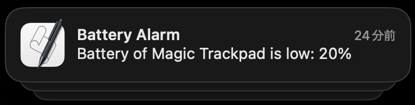

## Battery Alarm

This is a simple script that will check the battery level of devices connected via Bluetooth on Mac and notify if it is below a certain threshold.



## Usage

#### 1. Clone this repository

```sh
git clone git@github.com:walkersumida/battery-alarm.git
```

#### 2. Install

```sh
make install
```
